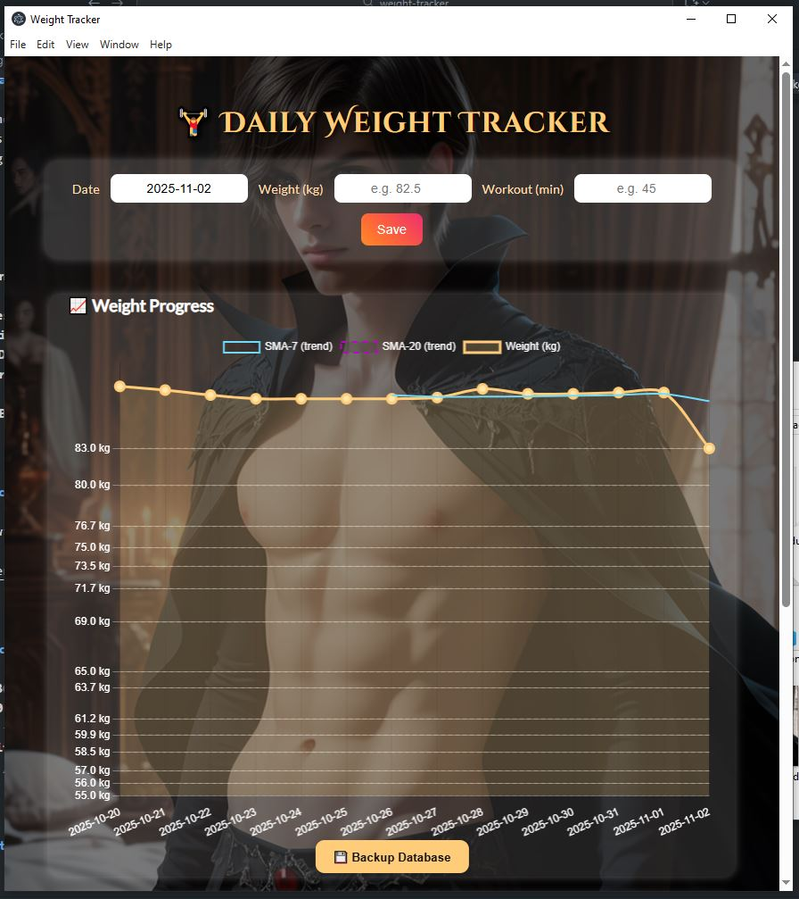

# ⚖️ Weight Tracker

A sleek, offline-first **daily weight tracking app** built with **Electron**, **Node.js**, and **Chart.js**.  
This tool helps you record your weight and workout minutes every day —  
while unlocking motivational milestones inspired by _Game of Thrones_ 🐺🔥.

---

## ✨ Features

- 🧮 **Daily Entry Form** – Log your weight and workout duration.
- 📊 **Dynamic Charts** – Visualize your progress using Chart.js.
- 🪄 **Goal Lines** – Automatically highlights major weight milestones.
- 🎉 **Motivational Popups** – Unlock special messages when you cross goals.
- 💾 **SQLite Database** – Stores your progress locally (`db/weight-tracker.db`).
- 🧱 **Auto-Carry Logic** – Fills missed days with your last known weight.
- 🔔 **Windows Task Scheduler Integration** – Launches the app automatically each night.
- 🧰 **Backup Button** – Instantly creates timestamped DB backups.

---

## 📸 Screenshot



---

## 🧠 Tech Stack

- **Electron v36.2.0** – Desktop runtime
- **Node.js v20.x** – Backend logic
- **Chart.js** – Visualization library
- **better-sqlite3** – Embedded database
- **HTML / CSS / JS** – Frontend UI

---

## 📂 Folder Structure

```
weight-tracker/
├─ main.js                 # Electron main process
├─ renderer.html           # UI for form and charts
├─ renderer.js             # Frontend logic, chart rendering, goal popup
├─ db/
│  ├─ weight-tracker.db    # Local SQLite database
│  └─ migrate.js           # Creates tables on startup
├─ electron_modules/       # Electron-specific node_modules
├─ assets/
│  ├─ wtbackground.jpg     # Background image
│  └─ screenshot.png       # (Replace with your app screenshot)
└─ launch_weight_tracker.vbs  # Used by Windows Task Scheduler
```

---

## ⚙️ Setup Instructions

1. **Clone or copy the project**

   ```bash
   git clone https://github.com/<your-username>/weight-tracker.git
   cd weight-tracker
   ```

2. **Install dependencies**

   ```bash
   npm install
   cd electron_modules
   npm install electron better-sqlite3
   cd ..
   ```

3. **Run the app**

   ```bash
   npm start
   ```

4. _(Optional)_ **Set up Task Scheduler**
   - Use the included `launch_weight_tracker.vbs` file to auto-launch the app at a chosen time.

---

## 🎯 Future Improvements

- [ ] Add sound effects when a goal is unlocked
- [ ] Sync with cloud backup (optional)
- [ ] Introduce calorie or habit tracking
- [ ] Show unlock timeline view

---

## 💬 Author

**Moditha Piyumal Wijeratne**  
📍 Sri Lanka  
_Translator, self-taught developer, and lifelong learner — building meaningful software for growth._

---

## 🏁 License

MIT License © 2025 Moditha Piyumal Wijeratne  
You’re free to use, modify, and distribute this project with attribution.
